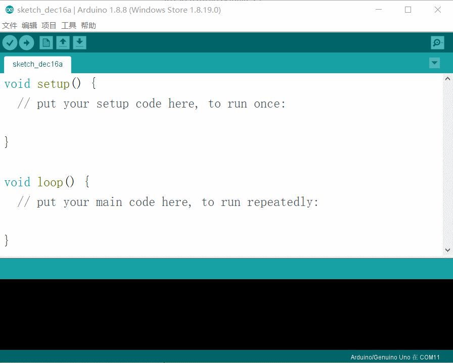
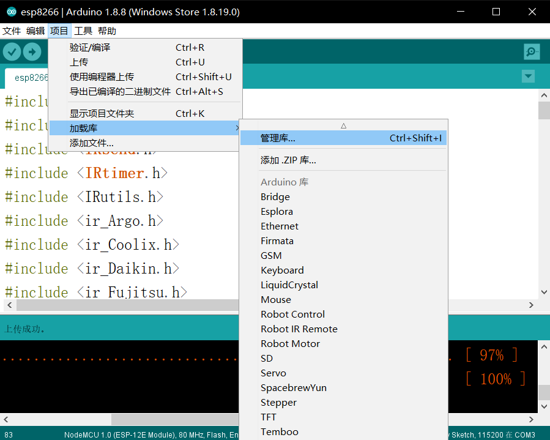
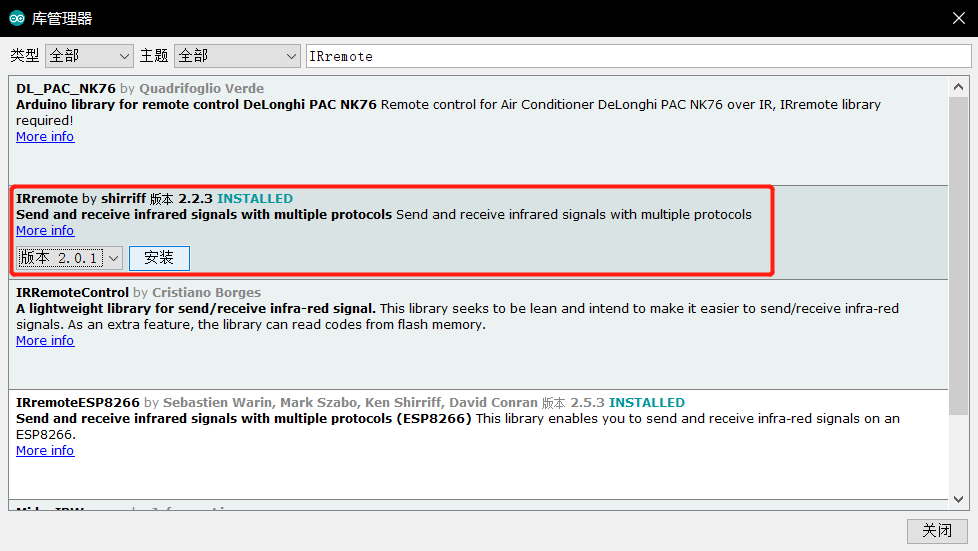
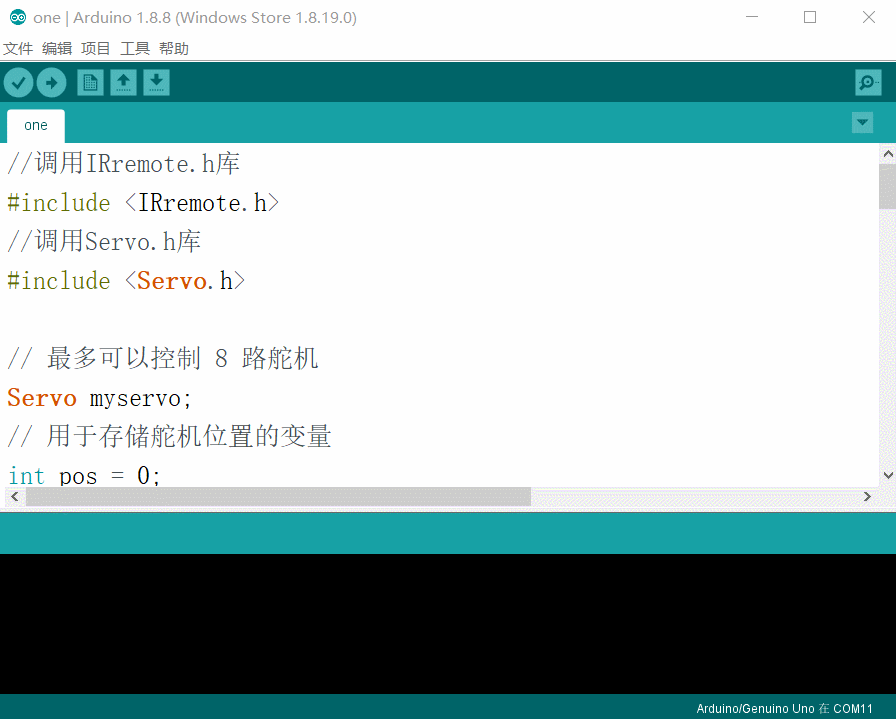
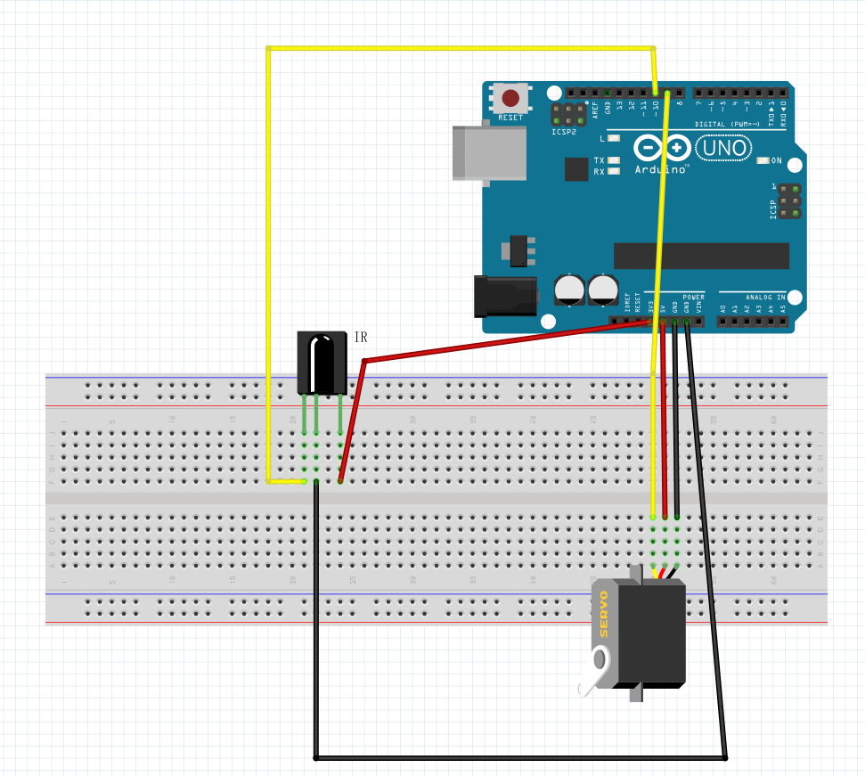
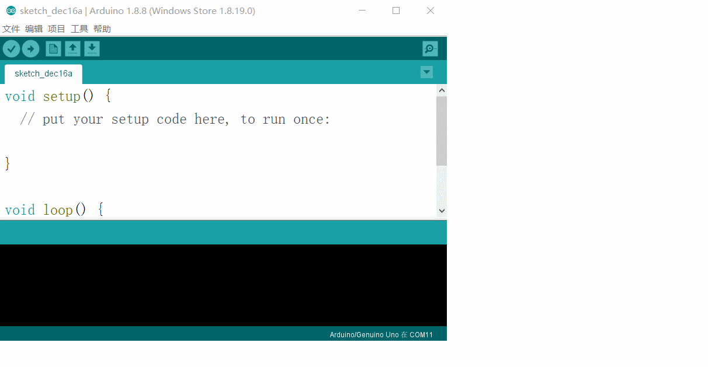
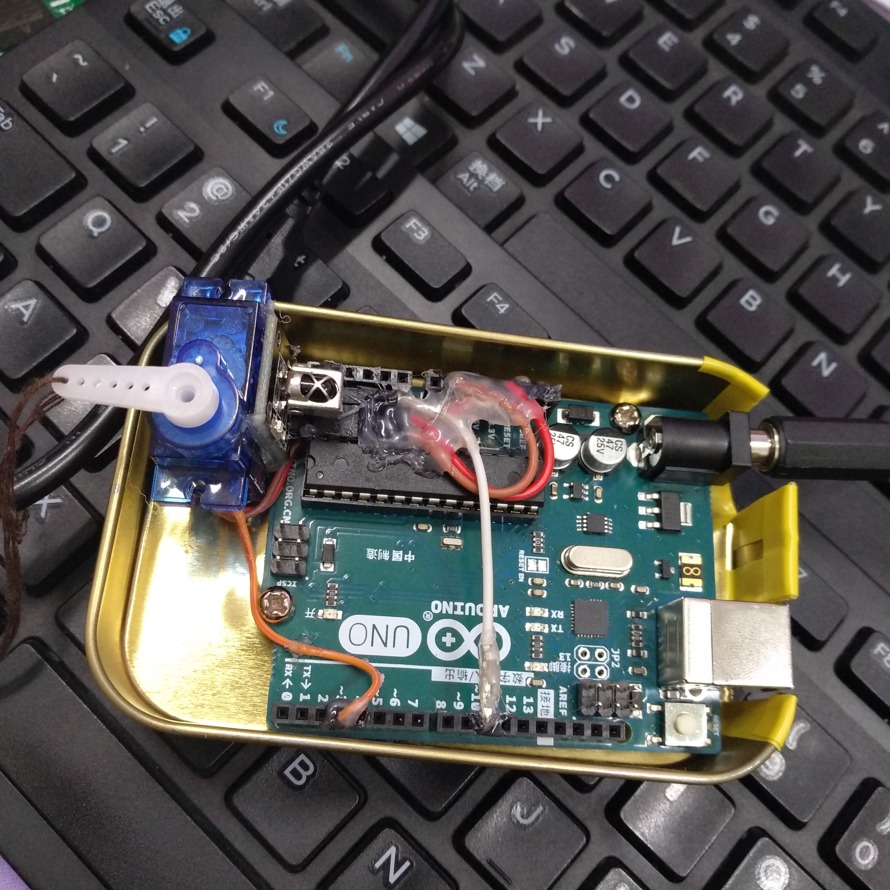

# 自制简单宿舍开门器--MiKa（arduino Uno版）
### 懒人福星，MiKa 拯救懒得下床开门，忙着做事不想走去开门的你，只需要按下遥控，即可开门。
#### 工具/材料：
​	SG09舵机 x1
​	Arduino Uno R3开发板 x1
​	红外接收模块 x1
​	杜邦线若干
​	7.4v锂电池 x1
​	带开关的数据线 x1
​	渔线 x1
​	3m VHB透明双面胶 x1

#### 一、烧录程序

##### 	将Arduino连接至电脑，写入程序。

在**工具**-**开发板**中选择**arduino/Genuino Uno**这一项，在端口中选择arduino Uno开发板的端口号。



在烧录之前确保我们有下载需要用到的IRremote库。如果没有，则在**项目**-**加载库**-**管理库...**中搜索**IRremote**。





点击菜单栏下面的右箭头——上传，将以下程序烧录至arduino中，等待几秒即可。



```
//调用IRremote.h库
#include <IRremote.h>
//调用Servo.h库
#include <Servo.h>

// 最多可以控制 8 路舵机
Servo myservo;
// 用于存储舵机位置的变量
int pos = 0;

//初始化

//定义RECV_PIN变量为10
int RECV_PIN = 10;
//设置RECV_PIN（也就是10引脚）为红外接收端
IRrecv irrecv(RECV_PIN);
//定义results变量为红外结果存放位置
decode_results results;
//设定执行程序的用户码，根据自己实际更改
long a[] = {0xFF02FD,0xD7E84B1B,0xA25DC639,0x61D648B7,0x61D6D827,0x61D658A7,0x61D620DF,0x61D6609F,0x61D6A05F};

void setup(){
	//串口波特率设为9600
	Serial.begin(9600); 
    //启动红外解码
	irrecv.enableIRIn();
	//设置9引脚为舵机信号接收端
	myservo.attach(9);
}

void loop(){
	//是否接收到解码数据,把接收到的数据存储在变量results中
  	if (irrecv.decode(&results)){
	//接收到的数据以16进制的方式在串口输出
	Serial.println(results.value, HEX);
		//判断接收到的用户码是否匹配
		for (int b =0;b<9;b++){
			if (results.value == a[b]){
				// 从 170 度 - 2 度，步进度数为5
				for (pos = 170; pos > 2; pos -= 5){
					// 输入对应的角度值，舵机会转到此位置
					myservo.write(pos);
					// 15ms 后进入下一个位置
					delay(15);
				}
				// 从 2 度 - 170 度，步进度数为5
				for(pos = 2; pos< 170; pos+=5){
					// 输入对应的角度值，舵机会转到此位置
					myservo.write(pos);
					// 15ms 后进入下一个位置
					delay(15);
				}
			}
		}
	// 继续等待接收下一组信号
	irrecv.resume();
	}
}
```

#### 二、组装

将红外接收模块和舵机连接到arduino上。一般的红外接收头，正接受面，从左往右依次是OUT、GND、VCC,当然还是按照实际情况来。(第一次画图，轻喷轻喷...)  


组装完后，点击**工具**--**串口监视器**或者直接按**Ctrl+Shift+M**打开串口监视器，如果程序已经正确烧录，则使用红外遥控器对着红外接收模块按下后，串口监视器就会显示接收到的用户码，每一个按钮都有一个特定的16进制代码。注意，串口监视器的波特率要选择**9600**波特率，与我们代码中的Serial.begin(9600)相匹配。  



这里我们设置的是以**十六进制**显示的。知道遥控上每一个按键对应的数据码是什么后，回到上面的程序中，第20行我们定义了一个数组，这个数组存放的就是我们遥控上每一个按键的数据码，如果当前接收到的数据码与数组中的一个数据码匹配成功，则舵机改变角度。因为是十六进制数，所以数组中每一个数据码都要在开头加上**0x**。长按一个键不放，则会出现“FFFFFFFF”。如果多次按下同一键，arduino识别出的用户码不同，据我判断要么是遥控器不好，要么是红外接收头出现问题了。  

接着找一个盒子，将arduino放到里面，最好将arduino底部涂满一层热熔胶或者将铁盒子与arduino接触的那一面贴一层电工胶布，防止arduino底部通电。  

找好锁放置的位置，量好拉锁与开门器间的距离，剪下足够距离的渔线，与舵机连接在一起。舵机和红外接收模块用热熔胶粘在一起，把红外接收头露出来，**不要挡着**，否则会接受不到信号。  

把数据线一部分剥开，里面应该有两条线，一条红色一条黑色或者一条红色一条白色的。红色为正极，另一根为负极，分别连接至锂电池的正负极。  

将数据线另一头的**正极**连接至arduino的**Vin口**，**负极**连接到**GND口**。  

将舵机和arduino边边连接在一起，放在盒子里，将盒子打洞，用螺丝固定arduino。盒子与门的接触面，贴上双面胶。这款双面胶粘性特别好，而且重点是无痕！这样就完成啦。  


#### 注意：
如果按下同一个键接收到的数据码不同的话，据我的感觉来看，应该是遥控器的问题，遥控器太劣质。我一开始用红外接收模块带附的遥控器，发现隔了四五米不到的距离，arduino接收到的数据码就会变了。离的很近，换个角度，arduino接收到的数据码还是会变。

各种的不稳定，后面单独去买了遥控器，贵一点的那种，效果就非常好了，隔了六七米都妥妥的，角度大点，测试了0°-70°都能正确接收到信号，非常稳定。

开始享受在床上不用下床即可开门的美好宿舍生活吧，。